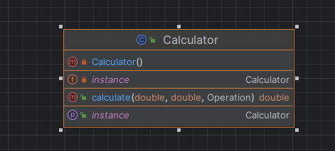
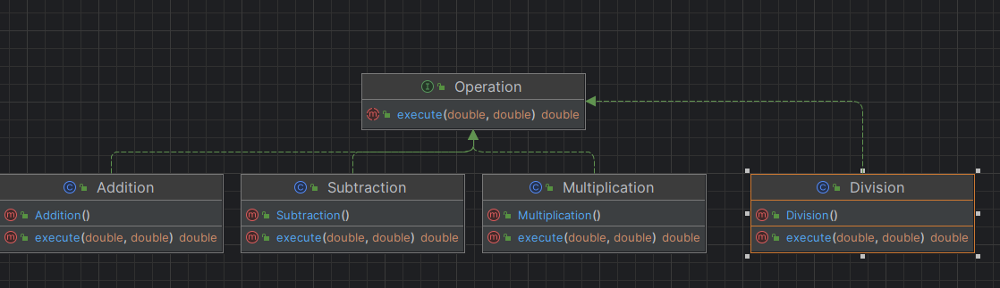
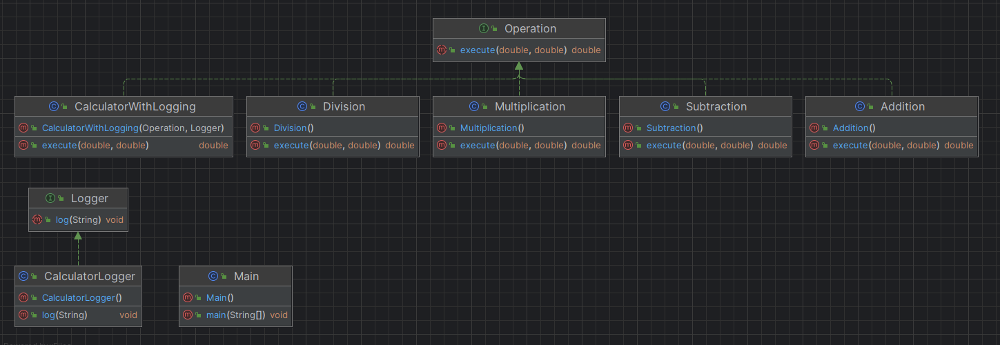
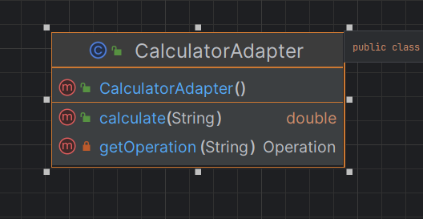
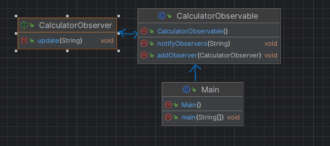
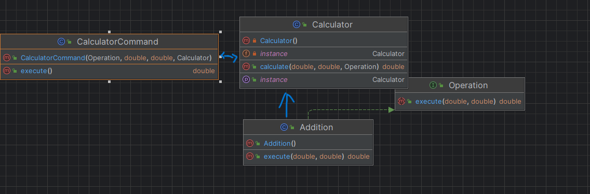

<<<<<<< HEAD
# Java Calculator Program
Link to repository: https://github.com/PreciousAmazu/ConsoleCalculator \
Note: I did this alone after getting permission from the teacher so the readme.md is an explanation of my work. \
This is a simple console-based calculator program written in Java. The program incorporates several design patterns to showcase good software engineering practices.
# Features:
•	Basic arithmetic operations: addition, subtraction, multiplication, and division.\
•	Logging of operations using the Decorator design pattern. \
•	Observer pattern for notifying external components about calculations.\
•	Command pattern for representing each operation as an object.
# Design Patterns Used:
## Creational Design Patterns:
### 1.	Singleton Pattern:
•	The Calculator class is implemented as a singleton to ensure that there is only one instance of the calculator throughout the program. This guarantees global access to the calculator instance and prevents multiple instances from being created unnecessarily.
```java
public class Calculator {
    private static Calculator instance;

    private Calculator() {}

    public static Calculator getInstance() {
        if (instance == null) {
            instance = new Calculator();
        }
        return instance;
    }
```

### 2.	Factory Method Pattern:
•The Operation interface serves as a factory method interface, defining a method for creating operation objects. Concrete implementations (Addition, Subtraction, etc.) provide the specific implementation of the factory method, allowing dynamic creation of different types of operations.
```java
public interface Operation {
    double execute(double operand1, double operand2);
}

```
```java
public class Addition implements Operation {
    @Override
    public double execute(double operand1, double operand2) {
        return operand1 + operand2;
    }
}
```
```java
public class Subtraction implements Operation {
    @Override
    public double execute(double operand1, double operand2) {
        return operand1 - operand2;
    }
}
```

## Structural Design Patterns:
### 1.	Decorator Pattern:
• The CalculatorWithLogging class acts as a decorator, extending the functionality of the basic calculator by adding logging capabilities. It wraps an existing operation object and adds logging functionality before or after the execution of the operation.
```java
public class CalculatorWithLogging implements Operation {
    private Operation operation;
    private Logger logger;

    public CalculatorWithLogging(Operation operation, Logger logger) {
        this.operation = operation;
        this.logger = logger;
    }

    @Override
    public double execute(double operand1, double operand2) {
        double result = operation.execute(operand1, operand2);
        logger.log("Performed operation: " + operation.getClass().getSimpleName());
        return result;
    }
}
```

### 2.	Adapter Pattern:
•	The CalculatorAdapter class acts as an adapter, allowing the calculator to handle input expressions in a flexible manner. It converts user input expressions into a format compatible with the calculator's calculation method.
```java
public class CalculatorAdapter {
    private Calculator calculator;

    public CalculatorAdapter() {
        this.calculator = Calculator.getInstance();
    }

    public double calculate(String expression) {
        // Regular expression to match operands and operator in the expression
        String regex = "(-?\\d+(\\.\\d+)?)\\s*([-+*/])\\s*(-?\\d+(\\.\\d+)?)";
        Pattern pattern = Pattern.compile(regex);
        Matcher matcher = pattern.matcher(expression);

        if (matcher.find()) {
            // Extract operands and operator
            double operand1 = Double.parseDouble(matcher.group(1));
            String operator = matcher.group(3);
            double operand2 = Double.parseDouble(matcher.group(4));

            // Map the operator to the corresponding Operation implementation
            Operation operation = getOperation(operator);

            // Perform calculation using Calculator instance
            return calculator.calculate(operand1, operand2, operation);
        } else {
            // Handle invalid expression
            System.out.println("Invalid expression format");
            return Double.NaN; // Return NaN for invalid expressions
        }
    }
```

## Behavioral Design Patterns:
### 1.	Observer Pattern:
•  The CalculatorObservable class implements the observable subject, allowing observers to subscribe and be notified when an operation is performed. Observers implement the CalculatorObserver interface to receive notifications.
```java
public interface CalculatorObserver {
    void update(String message);
}
```
```java
public class CalculatorObservable {
    private List<CalculatorObserver> observers = new ArrayList<>();

    public void addObserver(CalculatorObserver observer) {
        observers.add(observer);
    }

    public void notifyObservers(String message) {
        for (CalculatorObserver observer : observers) {
            observer.update(message);
        }
    }
}
```

### 2.	Command Pattern:
•	The CalculatorCommand class represents each operation as an object, enabling undo operations and maintaining a history of commands. It encapsulates a request as an object, allowing parameterization and queuing of requests. 
```java
public class CalculatorCommand {
    private Operation operation;
    private double operand1;
    private double operand2;
    private Calculator calculator;

    public CalculatorCommand(Operation operation, double operand1, double operand2, Calculator calculator) {
        this.operation = operation;
        this.operand1 = operand1;
        this.operand2 = operand2;
        this.calculator = calculator;
    }

    public double execute() {
        return calculator.calculate(operand1, operand2, operation);
    }
}
```

=======
Link to repository: https://github.com/PreciousAmazu/ConsoleCalculator

Java Calculator Program

Note: I did this alone after getting permission from the teacher so the readme.md is an explanation of my work.

This is a simple console-based calculator program written in Java. The program incorporates several design patterns to showcase good software engineering practices.

Features:

•	Basic arithmetic operations: addition, subtraction, multiplication, and division.

•	Logging of operations using the Decorator design pattern.

•	Observer pattern for notifying external components about calculations.

•	Command pattern for representing each operation as an object.

Design Patterns Used:

Creational Design Patterns:

1.	Singleton Pattern:

•	Ensures that a single instance of the Calculator class is used throughout the program.

2.	Factory Method Pattern:
	
•	Implements the Operation interface with classes like Addition, Subtraction, Multiplication, and Division to create different types of operations.

Structural Design Patterns:

1.	Decorator Pattern:
   
•	Enhances the basic calculator by adding logging capabilities with the CalculatorWithLogging class.

2.	Adapter Pattern:
   
•	Adapts input expressions to handle flexible calculations with the CalculatorAdapter class.

Behavioral Design Patterns:

1.	Observer Pattern:
   
•	Notifies external components (observers) about performed operations using the CalculatorObservable and CalculatorObserver interface.

3.	Command Pattern:
   
•	Represents each operation as an object with the CalculatorCommand class, facilitating undo operations and maintaining a history of commands.
>>>>>>> d44ed30c9b2559559c9c560327f0e610b21feb3c

How to Run:

1.	Ensure you have Java and an IDE (like IntelliJ IDEA) installed.
   
3.	Clone or download this repository.
4.	Open the project in your IDE.
5.	Run the Main class to execute the program.
Example Usage:
1.	Enter expressions like "5 + 3" when prompted.
2.	See the result of the calculation and any additional logging or observer notifications.
